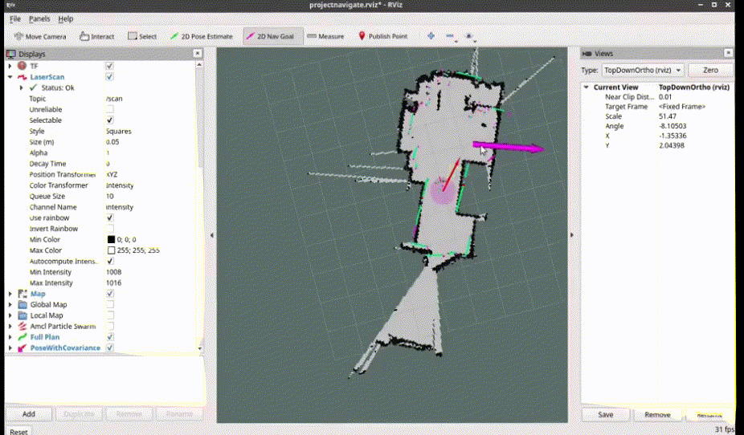

# 🚀  Autonomous mobile platform

Разработка автономного мобильного робота в рамках исследования современных подходов к автономной навигации, кинематике и компьютерному зрению.

## 📋 Описание

### Аппаратная часть
- Raspberry Pi 4 - главный компьютер, взаимодействует с датчиками (камера, лидар) напрямую или их контроллерами, а также обеспечивает удаленный доступ.
- Arduino uno/mega - управление сервоприводами манипулятора/моторами платформы и считывание колесных энкодеров. Взаимодействие с RPi с помощью rosserial.
- Intel neural compute stick 2 (VPU) - берет на себя обработку компьютерного зрения, не перегружая RPi. Имеет собственный программный стек для запуска нейросетей, что намного удобнее, чем собирать полноценный opencv.
- Kinect v1 - rgbd камера, позволяет одновременно получать цветное rgb изображение и 3d облако точек пространства (для каждого пикселя).
- YdLidar X2L - лидар, позволяет получать 2d контур препятствий вокруг робота заданного радиуса.
- колесные энкодеры (KY-040) - позволяют отслеживать изменения углового положения колес, для определения скорости робота и расчета кинематики движения платформы.
- сервомоторы - управляют движением манипулятора.

### Программная часть
- ROS Noetic установленный на Raspberry pi OS, со следующими пакетами:
- - rosserial - взаимодействие RPi с Arduino для передачи требуемой скорости платформы, данных энкодеров, и контрольной точки решателю прямой кинематики манипулятора.
- - diff_drive - пакет дифференциального привода, обеспечивает контроль скорости колес и движение платформы по заданной траектории, обрабатывая данные энкодеров.
- - teleop_twist_keyboard - позволяет вручную управлять движением робота с клавиатуры.
- - hector_slam - решает задачу одновременной локализации и картографирования (SLAM), позволяет опираясь на данные лидара и вручную управляя движением платформы построить 2d карту помещения для автономной навигации.
- - amcl - решает задачу локализации робота на известной карте (2d) при автономной навигации.
- - move_base - планировщик траектории, определяет требуемую скорость движения робота для достижения заданной координаты на карте при автономной навигации.
- openFrameworks/kinectExample - получение rgbd изображения с камеры Kinect.
- openvino/object_detection_sample_ssd - обнаружение объекта захвата манипулятора на изображении с помощью предварительно обученной ssd модели, и, далее, его пространственных координат относительно манипулятора платформы.
- manipulator_uno.ino - решатель прямой кинематики манипулятора, расчет значений углов звеньев для захвата объекта, реализованный на контроллере arduino.

## 📸 Демо

_построение карты_

_автономная навигация по построенной карте_

## 📚 Источники
- [diff_drive ROS package](https://github.com/merose/diff_drive) - пакет диффференциального привода, позволяющий контроллировать скорость робота и принимать данные одометрии колесных энкодеров.
- [openFrameworks/kinectExample](https://github.com/openframeworks/openFrameworks/tree/master/examples/computer_vision) - кросплатформенная среда разработки для простого подключения и захвата облака точек с камеры Kinect v1.
- [OpenMobileManipulator_project](https://github.com/panagelak/Open_Mobile_Manipulator) - проект с github, ставший отправной точкой для данной работы.
- [Full autonomous stack tutorial | ROS](https://yoraish.wordpress.com/2021/09/08/a-full-autonomous-stack-a-tutorial-ros-raspberry-pi-arduino-slam/) - общая инструкция по настройке локализации и картографирования(SLAM) мобильного лидара.
- [ROSwiki_navigation](https://wiki.ros.org/navigation) - официальная документация к стандартной системе навигации ROS (локализация AMCL + планировщик move_base)
